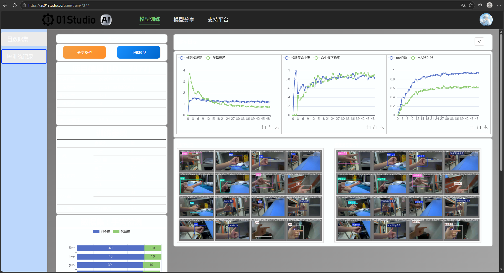
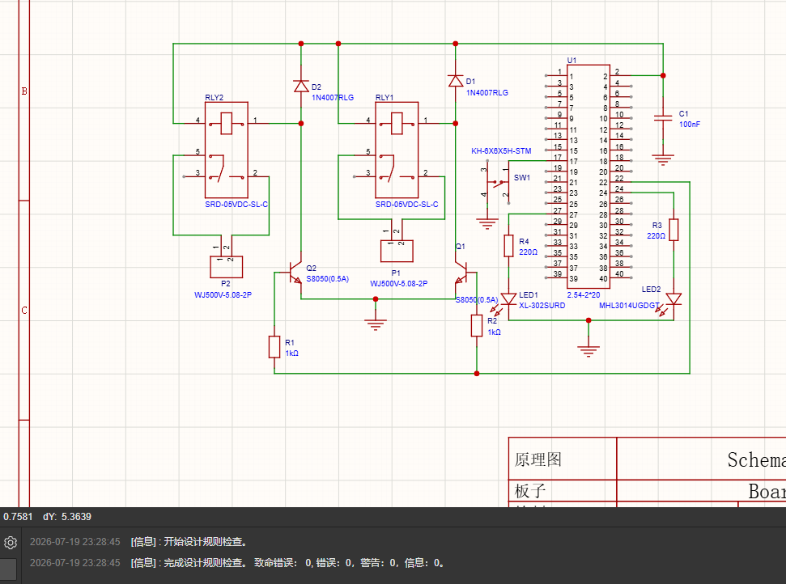
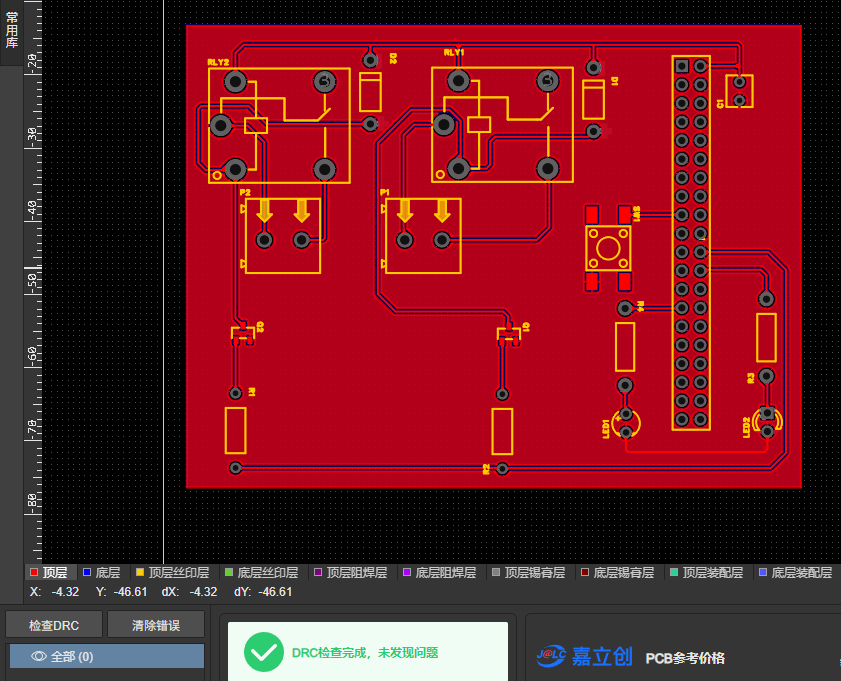

# 基于 K230 的手势识别控制系统设计报告

## 摘要

本项目基于嘉楠 K230 边缘 AI 芯片（立创庐山派开发板），设计并实现了一套实时手势识别控制系统。系统自主采集数据集训练 YOLO11n 目标检测模型，部署到板端 KPU 进行推理，实现 6 种手势的实时识别，并通过 GPIO 驱动 LED、蜂鸣器及自研 PCB 扩展板上的继电器，构成完整的"感知—推理—控制"闭环。系统还集成人脸检测模型，通过板载按键切换工作模式。实测手势识别 mAP@0.5 达 0.95，推理帧率约 30 FPS。

**关键词**：边缘计算；K230；YOLO11；手势识别；KPU；嵌入式 AI

---

## 1. 项目背景

随着边缘 AI 的发展，在低功耗、低成本终端上部署神经网络成为热点。K230 集成了 KPU（神经网络加速器），可在 3W 功耗下运行目标检测模型，适合嵌入式视觉应用。本项目以手势识别为切入点，完整走通从数据采集、模型训练、量化部署到硬件控制的全流程，验证国产边缘 AI 芯片的工程可行性。

---

## 2. 系统总体设计

### 2.1 硬件架构

```
GC2093 摄像头 → K230(CPU+KPU) → GPIO → 板载外设 / PCB扩展板
                    │
              手势模型 / 人脸模型
```

| 部件 | 型号 | 说明 |
|------|------|------|
| 主控 | K230（庐山派，1GB） | 双核 RISC-V + KPU |
| 摄像头 | GC2093 | CSI2 接口，1080P |
| 显示 | 3.1" MIPI 屏 / IDE 帧缓冲 | 调试用 |
| 外设 | RGB LED、蜂鸣器、按键 | 板载 |
| 扩展 | 自研 PCB（继电器×2） | 手势控制 |

### 2.2 软件架构

系统运行 CanMV（MicroPython）固件，主程序 `main.py` 上电自启。核心流程：

1. 摄像头采集帧
2. KPU 推理（手势模型或人脸模型）
3. 后处理（阈值过滤 + 防抖滤波）
4. GPIO 输出控制外设

---

## 3. 数据采集与模型训练

### 3.1 数据集

使用 K230 摄像头 + 板载按键触发拍照，自主采集 6 类手势共 300 张图像（每类 50 张），涵盖不同角度、距离、光照与左右手，提升泛化能力。

| 类别 | fist | five | yeah | gun | one | thumbUp |
|------|------|------|------|-----|-----|---------|
| 数量 | 50 | 50 | 50 | 50 | 50 | 50 |

标注采用目标检测格式（框出手掌 + 类别标签）。

### 3.2 训练

- 平台：01Studio 在线训练平台
- 模型：YOLO11n（nano，轻量化）
- 输入尺寸：320×320
- 训练轮次：50 epoch
- 目标板：K230，nncase v2.11.0

### 3.3 训练结果

| 指标 | 数值 |
|------|------|
| mAP@0.5 | 0.95 |
| mAP@0.5:0.95 | 0.62 |
| 推理帧率 | ~30 FPS |



*图 3-1 训练过程曲线（左：损失，中：验证集精度，右：mAP）*

损失曲线快速收敛后趋于平稳，验证集精度持续上升，无明显过拟合。mAP@0.5:0.95 偏低主要因标注框精度限制，后续可通过精细标注改善。

---

## 4. 模型部署与优化

### 4.1 部署流程

```
PyTorch → ONNX → nncase 量化(INT8) → kmodel → KPU 推理
```

模型经 nncase 工具链量化为 INT8 的 kmodel 格式，显著降低体积与推理延迟，部署到 K230 的 KPU 加速执行。

### 4.2 后处理优化

- **单类别置信度阈值**：针对易混淆手势（five/gun/one）分别设置阈值，降低误识别
- **2 帧防抖滤波**：连续 2 帧识别一致才切换输出，抑制偶发抖动，增加约 60ms 延迟换取稳定性

---

## 5. 硬件控制设计

### 5.1 GPIO 联动

板载外设已实现实时联动；扩展板继电器控制逻辑已在代码中实现，硬件为设计稿。

| 手势 | 板载反馈 |
|------|---------|
| fist | 绿灯 |
| five | 红灯 |
| yeah | 蓝灯 |
| gun | 蜂鸣器 |
| one | 蓝灯 + 蜂鸣器 |
| thumbUp | 红+绿灯 |

### 5.2 PCB 扩展板（设计）

自主设计双层 PCB 扩展板，插接于庐山派 40P 排针。已完成原理图、PCB 布局布线与 DRC 检查，导出生产文件。核心为两路继电器驱动电路：

```
GPIO ──[1KΩ]──→ S8050三极管基极
                  │
5V ──[继电器线圈]──→ 集电极
  │                │
  └──[1N4007续流]──┘
```

- **三极管驱动**：K230 GPIO 输出 3.3V，经 S8050 放大驱动 5V 继电器线圈
- **续流二极管**：1N4007 反并联在线圈两端，吸收断电瞬间反电动势，保护三极管
- **去耦电容**：100nF 并联在电源，抑制继电器通断引起的电源波动



*图 5-1 扩展板原理图（DRC 检查 0 错误）*



*图 5-2 PCB 布局布线（双层板，DRC 检查通过）*

### 5.3 多模式切换

板载按键实现手势模式与人脸模式切换，切换时 RGB LED 闪烁确认。人脸模式使用官方预训练 face_detection 模型，检测到人脸时蜂鸣器短鸣。

---

## 6. 系统测试

| 测试项 | 结果 |
|--------|------|
| 手势识别准确率 | mAP@0.5 = 0.95 |
| 推理帧率 | ~30 FPS |
| GPIO 响应延迟 | < 100ms |
| 脱机自启 | 上电自动运行，无需连接电脑 |
| 模式切换 | 按键切换稳定 |

---

## 7. 遇到的问题与解决

| 问题 | 解决方案 |
|------|---------|
| MIPI 屏有背光无画面 | 排查为供电/硬件问题，改用 IDE 帧缓冲调试，不影响主功能 |
| 双模型共享 KPU 冲突 | 改为按键切换的模式级加载，规避同时占用 |
| 手势偶发误识别 | 单类别阈值 + 2 帧防抖滤波 |
| 本地 AI Cube 训练失败 | CUDA 版本不兼容，改用 01Studio 在线平台 |

---

## 8. 总结与展望

本项目完整实现了基于国产边缘 AI 芯片的手势识别控制系统，走通了数据采集、模型训练、量化部署、硬件控制的全流程。系统运行稳定，识别准确率高，具备实用价值。

**后续可优化方向**：
- 精细标注提升 mAP@0.5:0.95
- 多模型帧级交替，实现手势 + 人脸并行推理
- PCB 扩展板接入电机、电磁锁等实际负载
- 增加语音提示、无线上报等功能

---

## 附录

- 源代码：GitHub 仓库
- 演示视频：手势识别 + 人脸检测（板载 LED / 蜂鸣器反馈）
- PCB 设计文件：原理图 + PCB 图 + BOM（已导出，未打样）

---
